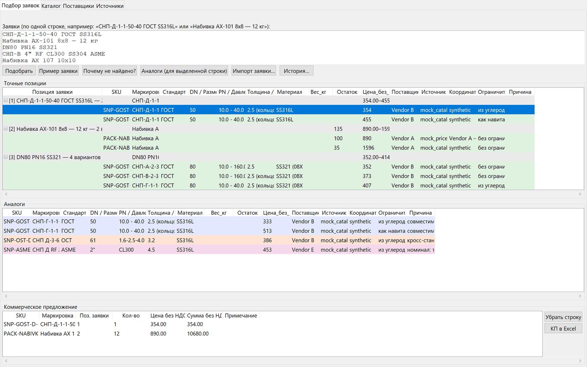
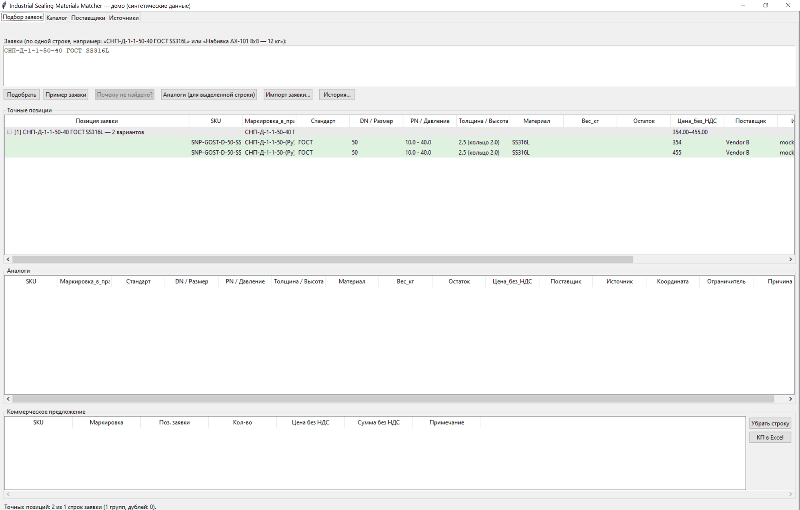
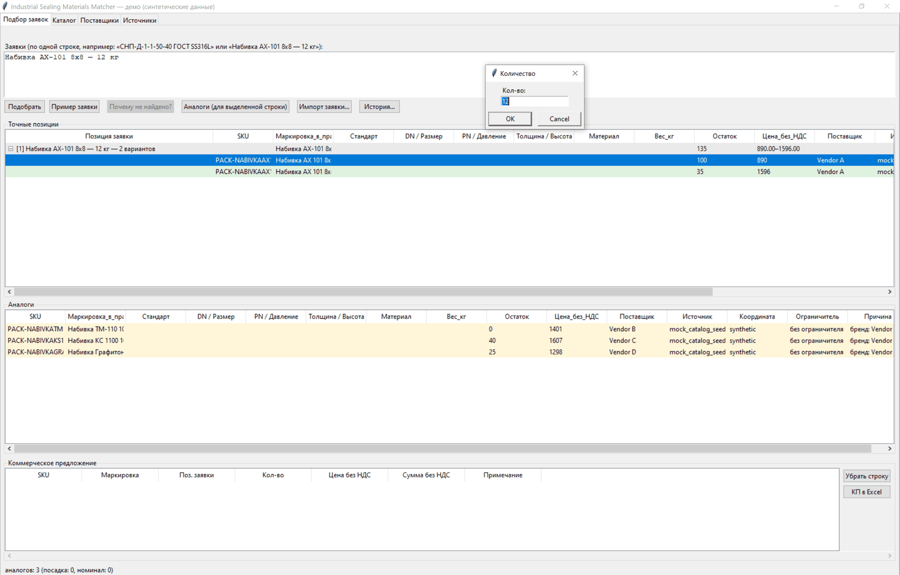
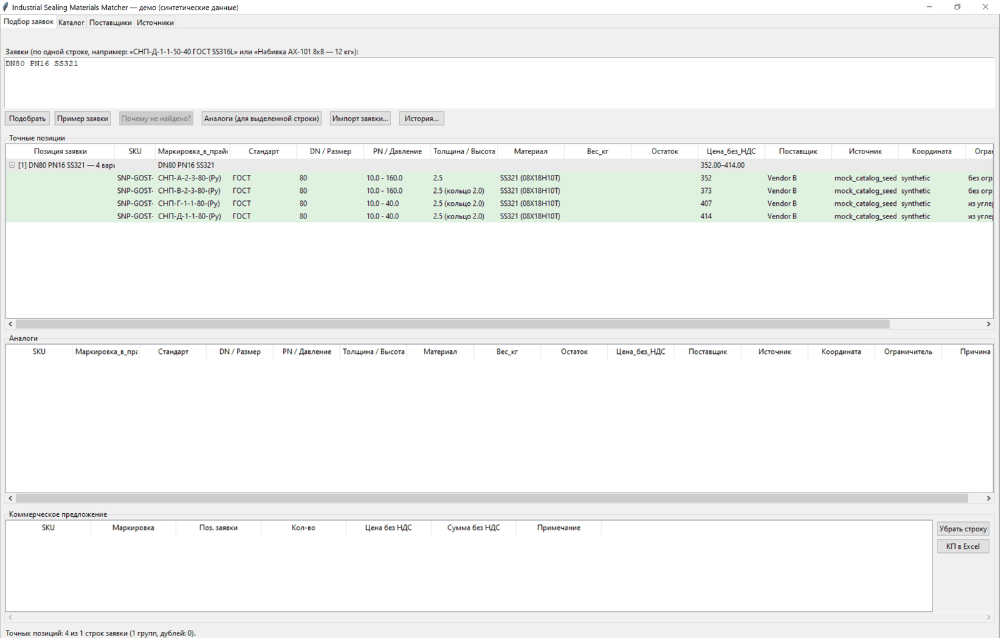
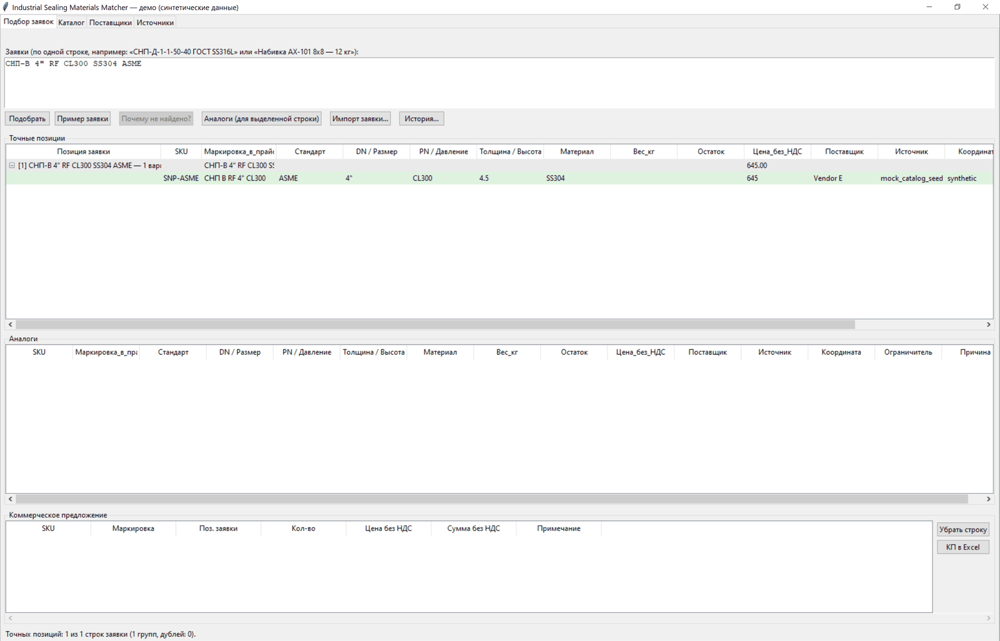
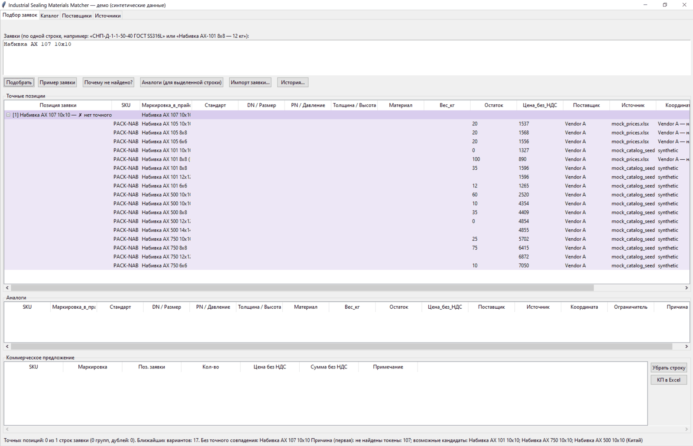
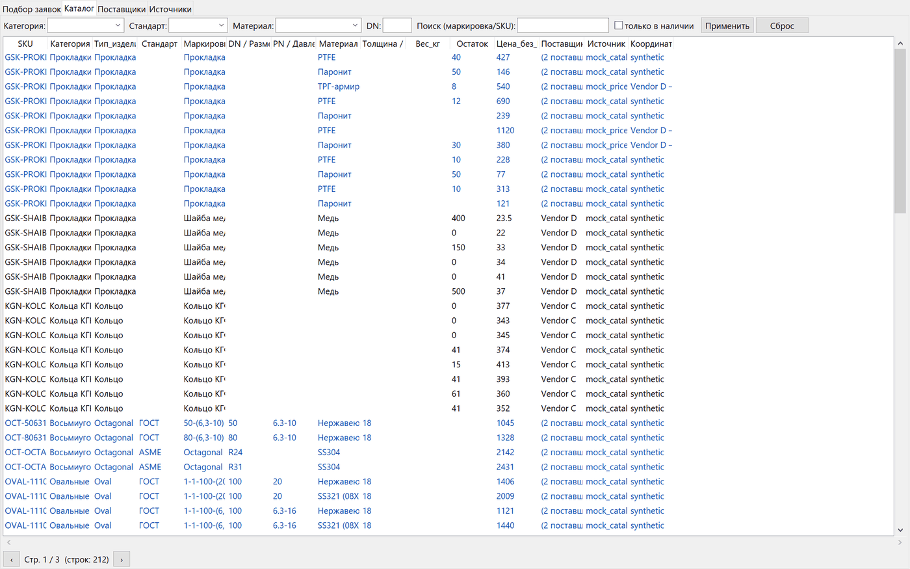
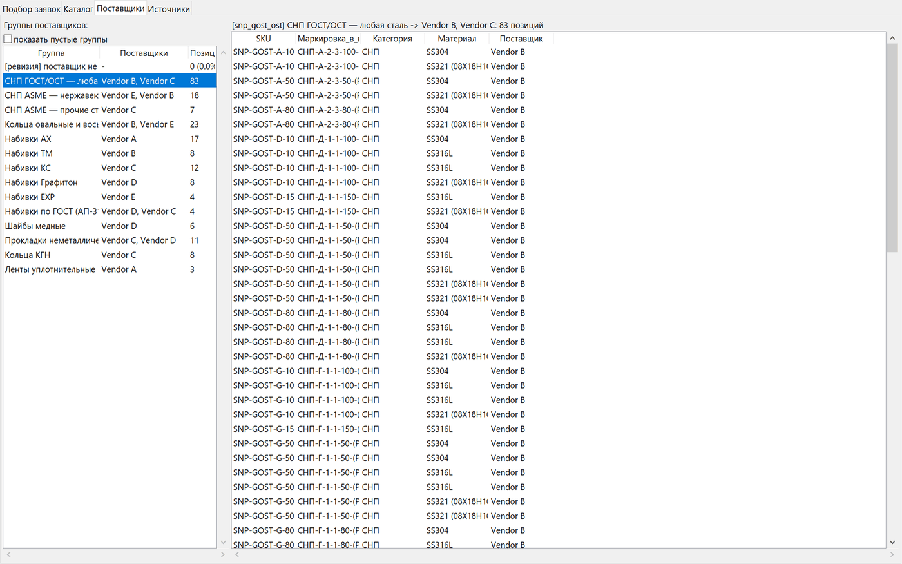
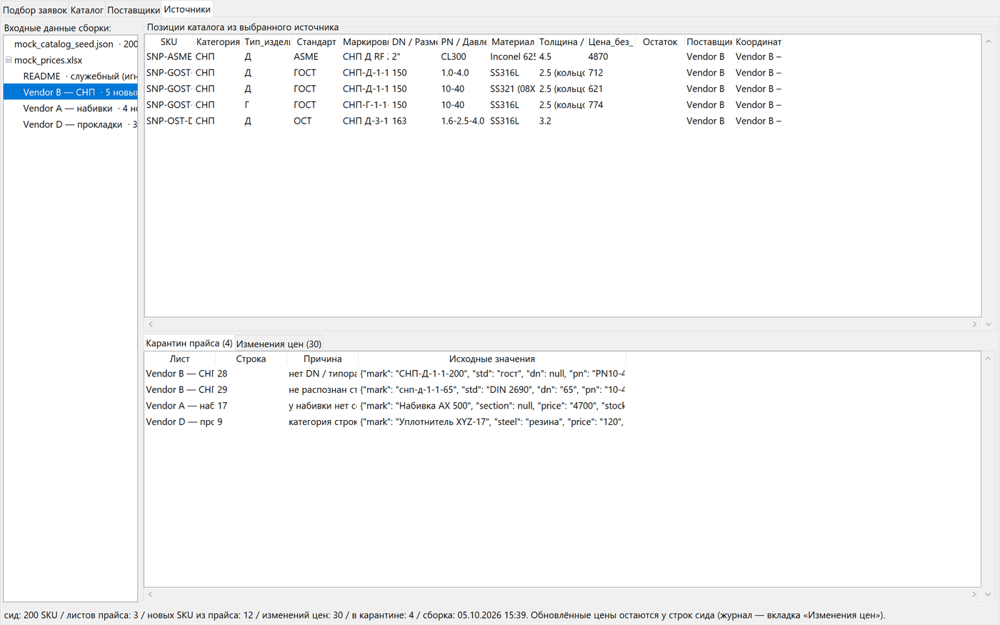

# Industrial Sealing Materials Matcher

**Портфолио-демо на синтетических данных.**

Обработчик B2B-заявок на промышленные уплотнительные материалы. Он собирает
каталог из «грязных» прайсов, разбирает заявку в свободной записи и находит
точные позиции. Если точной позиции нет, предлагает аналоги по другим
стандартам (ГОСТ / ОСТ / ASME) и брендам, объясняет промах и собирает
коммерческое предложение (КП) в Excel.



## Содержание

- [Быстрый старт](#быстрый-старт)
- [Демо-сценарии](#демо-сценарии)
- [Графический интерфейс](#графический-интерфейс)
- [Как это устроено](#как-это-устроено)
- [Что входит в демо и что опущено](#что-входит-в-демо-и-что-опущено)
- [Тесты и воспроизводимость](#тесты-и-воспроизводимость)
- [Структура проекта](#структура-проекта)
- [Документация](#документация)
- [Ограничения и известные особенности](#ограничения-и-известные-особенности)
- [Процесс разработки](#процесс-разработки)

## Быстрый старт

Нужен Python 3.11+. SQLite и Tkinter входят в стандартную библиотеку, сервер
БД и сеть не нужны.

**Windows (PowerShell):**

```powershell
py -m venv .venv
.\.venv\Scripts\Activate.ps1
pip install -r requirements.txt
python run_gui.py
```

Если PowerShell запрещает запуск `Activate.ps1`, сначала выполните
`Set-ExecutionPolicy -Scope Process RemoteSigned`.

**Linux / macOS:**

```bash
python3 -m venv .venv
source .venv/bin/activate
pip install -r requirements.txt
python run_gui.py
```

На Linux Tkinter ставится отдельным системным пакетом, например
`sudo apt install python3-tk` (Debian/Ubuntu).

При первом запуске `run_gui.py` сам собирает каталог из `data/` в
`out/sealmatch.sqlite`, отдельный шаг не нужен. Остальные команды:

```bash
python run_gui.py --rebuild   # пересобрать каталог из data/ и открыть окно
python build_mock.py          # консольное демо: сборка + прогон 5 заявок с отчётом
```

## Демо-сценарии

Все пять заявок вставляет кнопка «Пример заявки» на вкладке «Подбор заявок».
Каждую можно ввести и отдельно, а затем нажать «Подобрать».

| # | Заявка | Ожидаемый результат |
|---|---|---|
| 1 | `СНП-Д-1-1-50-40 ГОСТ SS316L` | 2 точных варианта (354 / 455 ₽) + кросс-аналоги ОСТ/ASME |
| 2 | `Набивка AX-101 8х8 — 12 кг` | 2 варианта, количество 12 распознано из текста, 3 брендовых аналога с причиной |
| 3 | `DN80 PN16 SS321` | 4 варианта (маршрут `criteria`, типы А/В/Г/Д), колонка «Ограничитель» |
| 4 | `СНП-В 4" RF CL300 SS304 ASME` | 1 точный вариант (ASME, класс CL300) |
| 5 | `Набивка AX 107 10x10` | промах: причина в статус-баре («не найдены токены: 107»), 17 ближайших вариантов |

### 1. Точный подбор по маркировке ГОСТ



Строка заявки раскрыта в группу «2 варианта», в шапке группы диапазон цен
354.00–455.00. Обе строки SS316L от Vendor B, толщина показана как
«2.5 (кольцо 2.0)». Чтобы повторить: введите заявку, нажмите «Подобрать» и
выделите вариант. В панели «Аналоги» появятся кросс-аналоги ОСТ/ASME.

### 2. Количество из текста и брендовые аналоги



«— 12 кг» вырезано из строки до поиска и стало количеством. Двойной клик по
варианту открывает диалог «Количество» со значением 12. При выделении
варианта ниже появляются 3 брендовых аналога (Vendor B, C, D) с причиной
«бренд: Vendor…» в последней колонке. Чтобы повторить: «Подобрать»,
выделить вариант, затем двойной клик по нему.

### 3. Подбор по критериям DN / PN / сталь



В строке нет маркировки, поэтому DN, давление и сталь применяются как
фильтры по колонкам каталога (маршрут `criteria`). Результат — 4 варианта
ГОСТ разных типов изделия. Колонка «Ограничитель» (прокрутите таблицу
вправо) различает «без ограничителя» и «из углеродки».

### 4. Заявка ASME в дюймах и классе давления



Дюймовый размер и класс давления разобраны из свободной записи. Найден
1 точный вариант: DN 4", CL300, толщина 4.5, Vendor E. Чтобы повторить:
введите заявку и нажмите «Подобрать». Если выделить строку, в панели
«Аналоги» появятся варианты других стандартов.

### 5. Промах и диагностика



Кода AX 107 в каталоге нет. Фиолетовая строка «✗ нет точного» раскрывается
в 17 ближайших вариантов: то же семейство AX, сначала по близости кода и
сечения. В статус-баре внизу полная причина промаха. Ближайшие варианты в
сумму КП автоматически не попадают. Кнопка «Почему не найдено?» показывает
разбор подробнее.

## Графический интерфейс

Четыре вкладки. Код окна тот же, что в рабочей версии (`src/gui.py`),
заменён только слой данных: каталог читается из SQLite, а не из PostgreSQL.

### Подбор заявок


Сверху поле заявок (одна позиция на строку) и кнопки «Подобрать»,
«Пример заявки», «Почему не найдено?», «Аналоги (для выделенной строки)».
Ниже три таблицы: «Точные позиции» (группа на каждую строку заявки), «Аналоги»
(строятся для выделенной строки, цвет обозначает уровень аналога) и
«Коммерческое предложение». Двойной клик по позиции добавляет её в КП,
«КП в Excel» сохраняет `out/КП/КП_NNN.xlsx` (НДС 22%).

### Каталог



Фильтры по категории, стандарту и материалу, поиск по маркировке и SKU.
Каталог выводится страницами по 100 строк, текущее положение видно в
статус-баре («Стр. X / Y (строк: N)»). Метка «(N поставщиков)» в колонке
«Поставщик» кликабельна и ведёт на вкладку «Поставщики».

### Поставщики



Карта «позиция → возможные поставщики». Слева группы-правила Vendor A–E из
`data/mock_suppliers.json`, справа позиции каталога выбранной группы. Чтобы
увидеть, какие строки покрывает правило, кликните по группе.

### Источники



Входные данные сборки: сид и листы мок-прайса со счётчиками строк. Снизу
две таблицы из служебных таблиц SQLite: «Карантин прайса» (4 строки, которые
нельзя однозначно превратить в позицию) и «Изменения цен» (30, с Δ%).
Выберите лист слева, чтобы увидеть его позиции.

## Как это устроено

```text
data/mock_catalog_seed.json (200 SKU) ─┐
data/mock_prices.xlsx (53 стр., 3 листа)┼─► build_mock.py ─► out/sealmatch.sqlite
                                        │   нормализация,    catalog (212 строк)
                                        │   карантин,        price_updates (30)
                                        │   слияние цен      quarantine (4)
                                        │                         │
data/mock_suppliers.json ───────────────┘                         ▼ src/db_sqlite.py
  (группы-правила, бренды)                               src/matching.py
                                       разбор заявки → resolve / criteria / generic
                                       аналоги, диагностика промаха, поставщики
                                                                  │
                                                ┌─────────────────┴──────────────┐
                                                ▼                                ▼
                                        src/gui.py (Tkinter)            src/kp_export.py
                                                                        out/КП/КП_NNN.xlsx
```

| Модуль | Ответственность |
|---|---|
| `src/core.py` | константы стандартов, карты сталей и конфигураций колец, нормализаторы, загрузчики справочников |
| `src/matching.py` | разбор заявки, маршрутизация, точный подбор, кросс- и брендовые аналоги, диагностика, ближайшие варианты, правила поставщиков |
| `src/parsers.py` | парсеры листов реальных прайсов (по смыслу заголовков, а не по позициям колонок) |
| `src/catalog.py` | сборка и обогащение каталога из разобранных листов |
| `src/mark_parser.py` | разбор маркировок изделий |
| `src/table_data.py` | абстракция табличных данных для парсеров |
| `src/gui.py` | окно менеджера: подбор, аналоги, КП, каталог, поставщики, источники |
| `src/db_sqlite.py` | чтение каталога и служебных таблиц из SQLite (только чтение) |
| `src/freshness.py` | проверка, не изменились ли входные данные после сборки каталога |
| `src/history.py` | журнал заявок (`out/request_history.json`) |
| `src/kp_export.py` | данные и оформление КП для Excel |

Алгоритм подбора (маршруты, асимметрии, guard-условия, история решений)
описан в [docs/SELECTION_SPEC.md](docs/SELECTION_SPEC.md).

## Что входит в демо и что опущено

По сравнению с рабочей версией:

- **SQLite вместо PostgreSQL.** В продакшене каталог — 26 колонок и
  3 индекса. В демо тот же контракт, но у колонок есть типы и добавлены
  таблицы `price_updates` и `quarantine`
  (см. [docs/DB_SCHEMA.md](docs/DB_SCHEMA.md)).
- **`src/parsers.py` и `src/catalog.py` лежат в репозитории для ревью кода,
  но в демо-сборке не вызываются.** Каталог демо собирает упрощённый
  загрузчик `build_mock.py` из сида и мок-прайса, а продуктовые парсеры
  написаны под раскладку реальных прайсов.
- **Не входят интеграционные слои** (read-only для Bitrix24, сопоставление
  с 1С) и аудит поставщиков.
- **Все данные синтетические** (`seed=42`): Vendor A–E вместо реальных
  поставщиков, без реальных цен, клиентов и истории заявок.
- **Масштаб:** 212 строк и 7 категорий вместо продуктовых 15 589 и 10.
- **Тесты:** 9 smoke-тестов вместо полного продуктового комплекта
  (100+ проверок).
- **Вкладка «Источники» переписана под демо:** сид, листы прайса,
  карантин, изменения цен.

## Тесты и воспроизводимость

```bash
python -m pytest tests/test_gui_smoke.py -v    # 9 passed
```

Тесты собирают каталог во временную папку, поэтому проходят на чистой копии
без `out/`. Что проверяется:

- каталог загружается из SQLite (212 строк, 26 колонок), отсутствующая БД
  даёт понятную ошибку, а не пустой файл;
- окно создаётся, все 4 вкладки отрисованы;
- демо-заявка: строки 1–4 найдены, строка 5 — промах с ближайшими
  вариантами;
- аналоги по выделенной строке;
- фильтры каталога;
- синтетические поставщики;
- карантин на вкладке «Источники».

На машине без дисплея GUI-тесты пропускаются (skip), а не падают.

Генератор синтетики детерминирован (`seed=42`). JSON-файлы при повторной
генерации совпадают побайтово:

```powershell
# Windows PowerShell
$h1 = (Get-FileHash data\mock_catalog_seed.json, data\mock_suppliers.json).Hash
python tools\generate_mock_data.py
$h2 = (Get-FileHash data\mock_catalog_seed.json, data\mock_suppliers.json).Hash
-not (Compare-Object $h1 $h2)   # True
```

```bash
# Linux / macOS
sha256sum data/*.json > /tmp/h1
python tools/generate_mock_data.py
sha256sum -c /tmp/h1            # оба файла: OK
```

У `data/mock_prices.xlsx` хеш при каждой генерации новый: openpyxl
записывает в метаданные книги время создания. Содержимое листов при этом
совпадает. После генерации запустите `python run_gui.py --rebuild`, иначе
появится баннер «устарело».

## Структура проекта

```text
├── run_gui.py                  # запуск GUI; без out/sealmatch.sqlite сам собирает каталог
├── build_mock.py               # сборка каталога из синтетики + консольный прогон заявок
├── requirements.txt            # pandas, openpyxl, pytest
├── data/
│   ├── mock_catalog_seed.json  # сид: 200 синтетических SKU
│   ├── mock_prices.xlsx        # «грязный» прайс: 53 строки, 3 листа
│   └── mock_suppliers.json     # Vendor A–E: 15 групп-правил, 3 класса брендов
├── src/                        # ядро подбора, парсеры, GUI и слой данных (см. «Как это устроено»)
├── tests/
│   └── test_gui_smoke.py       # 9 smoke-тестов GUI и загрузки каталога
├── tools/
│   └── generate_mock_data.py   # генератор синтетики (seed=42)
├── docs/
│   ├── SELECTION_SPEC.md
│   ├── DB_SCHEMA.md
│   ├── ENGINEERING_RULES.md
│   └── screenshots/            # 4 кадра вкладок + 5 кадров демо-сценариев
└── out/                        # создаётся при сборке (в .gitignore): SQLite, КП, журнал заявок
```

## Документация

- [docs/SELECTION_SPEC.md](docs/SELECTION_SPEC.md) — алгоритмы подбора:
  карта маршрутов, намеренные асимметрии, кросс-аналоги, диагностика промахов.
- [docs/DB_SCHEMA.md](docs/DB_SCHEMA.md) — схема SQLite (26 колонок,
  индексы, служебные таблицы) и проверенные SQL-запросы.
- [docs/ENGINEERING_RULES.md](docs/ENGINEERING_RULES.md) — инженерные
  правила: инварианты, стоп-гейты, регрессии.

## Ограничения и известные особенности

- **Масштаб экрана больше 100%.** Ширина колонок задана в пикселях, поэтому
  таблицы не помещаются в окно и прокручиваются горизонтально.
- **Ctrl+C в таблицах** привязан к коду клавиши Windows. На Linux и macOS
  копируйте через контекстное меню (правая кнопка мыши).
- **Баннер свежести сравнивает время изменения файлов.** После регенерации
  `data/` без `--rebuild` он может показать «устарело», даже если
  содержимое не изменилось.

## Процесс разработки

Проект рос итерациями. Каждая итерация начиналась с разведки данных и
заканчивалась приёмкой: регрессионными тестами и обновлением инвариантов.
ИИ-агент использовался как инструмент разработки и работал по постоянному
файлу правил. Правила и процесс описаны в
[docs/ENGINEERING_RULES.md](docs/ENGINEERING_RULES.md).

---

Все данные в репозитории синтетические (`tools/generate_mock_data.py`,
`seed=42`). Коммерческих данных нет.
